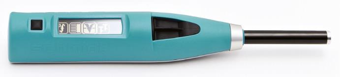
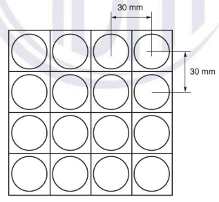

## Principais Ensaios Não Destrutivos (END) para avaliação de estruturas de concreto

::: {.incremental}
1. **Ensaio com esclerômetro** -- para estimativa da resistência do concreto à compressão *in-situ*, por meio da avaliação da dureza superficial do concreto
2. **Ensaios com ultrassom** -- para verificação da integridade do concreto e avaliação da resistência a compressão e módulo de elasticidade
3. **Ensaio com pacômetro** -- para detecção e determinação do diâmetro de armaduras e espessura de cobrimento
4. **Ensaios de potencial de corrosão** -- para identificação de áreas com maior probabilidade de ocorrência de corrosão nas armaduras dos elementos estruturais em concreto armado
5. **Ensaios de frente de carbonatação** -- para verificação da carbonatação do concreto
6. **Ensaios de extensometria (ET)** -- este ensaio consiste na instalação de  extensômetros elétricos de resistência (*strain-gages*) em uma estrutura, visando a medição em tempo real de deformações e tensões reais decorrentes de um determinado carregamento. Quando são instalados vários sensores em uma mesma seção de um elemento estrutural, também é possível se determinar os esforços internos nesta seção
:::

<!-- Esclerometria - Slide 00 - divider -->
# 1. Ensaio de esclerometria para estimativa da resistência do concreto {.title-slide}

<!-- Esclerometria - Slide 01 -->
##  
::: {.tpl-text-carousel title="1. Ensaio de esclerometria para estimativa da resistência do concreto" subtitle="1.1. Equipamento, procedimento normativo e execução do ensaio"
        img="ppt/media/image4.jpeg" 
          alt="Esclerômetro digital marca Proceq" 
        img_norma="ppt/media/esclerometria/ABNT-NBR-7584-2012.png" 
          alt_norma="Norma ABNT NBR-7584-2012 - Concreto endurecido -- Avaliação da dureza superficial pelo esclerômetro de reflexão -- Método de Ensaio"     
        img_mecanismo="ppt/media/esclerometria/esclerometroPortuguesRecorte.png" 
          alt_mecanismo="Mecanismo de funcionamento do esclerômetro"   
        img_bigorna="ppt/media/esclerometria/NBR-7584_2012_Figura01-bigorna.png" 
          alt_bigorna="Bigorna de aço para calibração do esclerômetro. Ref.: Figura 1, NBR 7584:2012"        
        img_area="ppt/media/esclerometria/NBR-7584-2012-Figura02-Area-de-ensaio.png" 
          alt_area="Área de ensaio e pontos de impacto. Ref.: Figura 2, NBR 7584:2012"   
        img_locais="ppt/media/esclerometria/NBR-7584_2012_Figura03-locais-recomendaveis.png" 
          alt_locais="Locais recomendáveis para aplicação do esclerômetro. Ref.: Figura 3, NBR 7584:2012"      
        img_ponte="ppt/media/esclerometria/190909-MRS-PonteParaibaII-Esclerometria01.jpeg" 
          alt_ponte="Execução do ensaio, pela empresa Dynamis Techne, em uma ponte ferroviária em concreto armado, localizada em Cruzeiro-SP." 
        carousel="true" }

- **Esclerômetro** -- Esclerômetro digital marca Proceq

::: {.incremental}
- **Norma de referência** -- ABNT NBR 7584:2012 - Concreto endurecido -- Avaliação da dureza superficial pelo esclerômetro de reflexão -- Método de Ensaio
- **Mecanismo de funcionamento** -- O esclerômetro consiste em uma massa-martelo que, impulsionada por uma mola, se choca com a área de ensaio através de uma haste e, a partir da energia de impacto e do deslocamento de retorno da haste, é possível se obter um valor de *dureza superficial* do concreto
- **Calibração do equipamento** -- O esclerômetro deve ser aferido antes de sua utilização ou a cada 300 impactos realizados na mesma inspeção, por meio de ensaios em bigornas de aço
- **Área de ensaio** -- Em cada área de ensaio, devem ser efetuados 16 impactos, formando um grid 4x4, com espaçamento de 30mm
- **Locais recomendáveis para ensaio** -- Sempre que possível, o ensaio deve ser realizado na posição de maior momento de inércia do elemento estrutural
- **Exemplo de ensaio** -- Execução do ensaio em uma *ponte ferroviária* em concreto armado, localizada em Cruzeiro-SP

:::

:::

<!-- Esclerometria - Slide 02 -->
## 1.2. Análise dos resultados e correlação com resistência à compressão

<!-- 
::: {.tpl-text title="1. Ensaio de Esclerometria para estimativa da resistência do concreto" subtitle="1.2. Análise dos resultados e correlação com resistência à compressão"}
-->

::: {.incremental}
- **Média inicial** - Calcular a média aritmética dos 16 valores individuais (impactos) dos índices esclerométricos
  correspondentes a uma única área de ensaio;
- **Resultados espúrios** - *Desprezar* todo índice esclerométrico individual que esteja afastado em *mais de 10%* do valor médio obtido e calcular a nova média aritmética;
- **Índice esclerométrico médio final** 
  - O índice final deve ser obtido com no mínimo *cinco* valores individuais;
  - Quando isso não for possível, o ensaio esclerométrico dessa área deve ser desconsiderado;
  - *Nenhum* dos índices esclerométricos individuais restantes deve diferir em *mais de 10%* da média final;
  - Se isso ocorrer, o ensaio esclerométrico dessa área deve ser desconsiderado.

:::

<!-- Esclerometria - Slide 03 -->
## 1.3. Exemplos de execução do ensaio
::: {.tpl-text-carousel title="Ensaio de Esclerometria para estimativa da resistência do concreto" subtitle="Análise dos resultados e correlação com resistência à compressão"
        img="ppt/media/image4.jpeg" 
          alt="Esclerômetro digital marca Proceq" 
        img_norma="ppt/media/esclerometria/ABNT-NBR-7584-2012.png" 
          alt_norma="Norma ABNT NBR-7584-2012 - Concreto endurecido -- Avaliação da dureza superficial pelo esclerômetro de reflexão -- Método de Ensaio"     
        img_mecanismo="ppt/media/esclerometria/esclerometroPortuguesRecorte.png" 
          alt_mecanismo="Mecanismo de funcionamento do esclerômetro"   
        img_bigorna="ppt/media/esclerometria/NBR-7584_2012_Figura01-bigorna.png" 
          alt_bigorna="Bigorna de aço para calibração do esclerômetro. Ref.: Figura 1, NBR 7584:2012"        
        img_area="ppt/media/esclerometria/NBR-7584-2012-Figura02-Area-de-ensaio.png" 
          alt_area="Área de ensaio e pontos de impacto. Ref.: Figura 2, NBR 7584:2012"   
        img_locais="ppt/media/esclerometria/NBR-7584_2012_Figura03-locais-recomendaveis.png" 
          alt_locais="Locais recomendáveis para aplicação do esclerômetro. Ref.: Figura 3, NBR 7584:2012"      
        img_ponte="ppt/media/esclerometria/190909-MRS-PonteParaibaII-Esclerometria01.jpeg" 
          alt_ponte="Execução do ensaio, pela empresa Dynamis Techne, em uma ponte ferroviária em concreto armado, localizada em Cruzeiro-SP." 
        carousel="true" }

- **Esclerômetro** -- Esclerômetro digital marca Proceq

::: {.incremental}
- **Norma de referência** -- ABNT NBR 7584:2012 - Concreto endurecido -- Avaliação da dureza superficial pelo esclerômetro de reflexão -- Método de Ensaio
- **Mecanismo de funcionamento** -- O esclerômetro consiste em uma massa-martelo que, impulsionada por uma mola, se choca com a área de ensaio através de uma haste e, a partir da energia de impacto e do deslocamento de retorno da haste, é possível se obter um valor de *dureza superficial* do concreto
- **Calibração do equipamento** -- O esclerômetro deve ser aferido antes de sua utilização ou a cada 300 impactos realizados na mesma inspeção, por meio de ensaios em bigornas de aço
- **Área de ensaio** -- Em cada área de ensaio, devem ser efetuados 16 impactos, formando um grid 4x4, com espaçamento de 30mm
- **Locais recomendáveis para ensaio** -- Sempre que possível, o ensaio deve ser realizado na posição de maior momento de inércia do elemento estrutural
- **Exemplo de ensaio** -- Execução do ensaio em uma *ponte ferroviária* em concreto armado, localizada em Cruzeiro-SP

:::

:::

::: {.tpl-wide-image title="Ensaio de Esclerometria para Determinação da Dureza Superficial do Concreto" subtitle="Equipamento e etapas do ensaio veja como isso ficou legal"
        img="ppt/media/image4.jpeg" 
          alt="Esclerômetro digital marca Proceq" 
        img_area="ppt/media/esclerometria/NBR-7584-2012-Figura02-Area-de-ensaio.png" 
          alt_area="Área de ensaio e pontos de impacto. Ref.: Figura 2, NBR 7584:2012"        
        img_ponte="ppt/media/esclerometria/190909-MRS-PonteParaibaII-Esclerometria01.jpeg" 
          alt_ponte="Execução do ensaio, pela empresa Dynamis Techne, em uma ponte ferroviária em concreto armado, localizada em Cruzeiro-SP." 
        img_viga="ppt/media/image9.jpeg" 
          alt_viga="Execuçãdo do ensaio em uma viga de concreto"  
        carousel="true" }
:::

---

## Principais Ensaios Não Destrutivos (END) para avaliação de estruturas de concreto:

::: {.incremental}
- **Ensaio com esclerômetro** -- para estimativa da resistência do concreto à compressão *in-situ*, por meio da avaliação da dureza superficial do concreto
- **Ensaios com ultrassom** -- para verificação da integridade do concreto e avaliação da resistência a compressão e módulo de elasticidade
- **Ensaio com pacômetro** -- para detecção e determinação do diâmetro de armaduras e espessura de cobrimento
- **Ensaios de potencial de corrosão** -- para identificação de áreas com maior probabilidade de ocorrência de corrosão nas armaduras dos elementos estruturais em concreto armado
- **Ensaios de frente de carbonatação** -- para verificação da carbonatação do concreto
- **Ensaios de extensometria (ET)** -- este ensaio consiste na instalação de  extensômetros elétricos de resistência (*strain-gages*) em uma estrutura, visando a medição em tempo real de deformações e tensões reais decorrentes de um determinado carregamento. Quando são instalados vários sensores em uma mesma seção de um elemento estrutural, também é possível se determinar os esforços internos nesta seção
:::

## Ensaios semi-destrutivos para avaliação do material

- Extração de testemunhos
- Ensaios de resistência à compressão
- Ensaio de módulo de elasticidade

## Ensaios não-destrutivos para avaliação de estacas

- PIT -- Pile Integrity Test -- Teste de integridade em estacas
- Outros\...

## Ensaio com esclerômetro para determinação da dureza superficial do concreto

::: {.incremental}
- O esclerômetro consiste em uma massa-martelo que, impulsionada por uma mola, se choca com a área de ensaio através de uma haste;
- **Norma NBR 7584:2012 Concreto endurecido** -- Avaliação da dureza superficial pelo esclerômetro de reflexão -- Método de Ensaio;
:::

::: {.fragment}

Esclerômetro Proceq -- SilverSchmidt .
:::

::: {.fragment}

Esclerômetro Proceq -- SilverSchmidt .
:::

---

::: {.tpl-text-image title="Ensaio com esclerômetro para determinação da dureza superficial do concreto" img="ppt/media/image4.jpeg" alt="Equipamento de esclerometria" caption="Exemplo de equipamento para ensaio in-situ"}
::: {.incremental}
- O esclerômetro consiste em uma massa-martelo que, impulsionada por uma mola, se choca com a área de ensaio através de uma haste;
- **Norma NBR 7584:2012 Concreto endurecido** -- Avaliação da dureza superficial pelo esclerômetro de reflexão -- Método de Ensaio;
- A dureza superficial do concreto é um indicador indireto da resistência à compressão, mas pode ser influenciada por diversos fatores, como tipo de agregado, umidade, idade do concreto e condições de cura.
- A correlação entre os valores de dureza superficial e a resistência à compressão deve ser estabelecida para cada estrutura, preferencialmente por meio de ensaios complementares, como a extração de testemunhos.
:::
:::

## Últimas referências normativas nacionais

NBR  5739:2018 --  Concreto -- Ensaios de compressão de corpos-de-prova cilíndricos

NBR  7584:2012 --  Concreto endurecido -- Avaliação da dureza superficial pelo esclerômetro de reflexão

NBR  7680-1:2015 --  Concreto -- Extração, preparo, ensaio e análise de testemunhos de estruturas de concreto. Parte 1: Resistência a compressão axial

NBR  7680-2:2015 --  Concreto -- Extração, preparo, ensaio e análise de testemunhos de estruturas de concreto. Parte 2: Resistência à tração na flexão

NBR  8522-1:2021 --  Concreto endurecido -- Determinação dos módulos de elasticidade e de deformação. Parte 1: Módulos estáticos à compressão

NBR  8522-2:2021 --  Concreto endurecido -- Determinação dos módulos de elasticidade e de deformação. Parte 2: Módulo de elasticidade dinâmico pelo método das frequências naturais de vibração

NBR  8802:2019 --  Concreto endurecido -- Determinação da velocidade de propagação de onda ultrassônica

## Referências normativas internacionais

Norma Britânica  BS1881-201 --  Testing concrete. Guide to the use of non- destructive methods of test for hardened concrete

Norma Alemã DIN EN 14630 --  Products and systems for the protection and repair of concrete structures -- Test methods -- Determination of carbonation depth in hardened concrete by the phenolphthalein method " 

Norma Chinesa JGJ/T 23-2001 -- Technical specification for inspection of concrete compressive strength by rebound method .

Norma Americana ACI 228.2R-13 - Report on Nondestructive Test Methods for Evaluation of Concrete in Structures

Norma Americana ASTM C 876 -- Standard test method for corrosion potentials of uncoated steel in concrete

Norma Americana ASTM -- D5882 -- 16 --  Standard Test Method for Low Strain Impact Integrity Testing of Deep Foundations " (Método de teste padrão para ensaio de integridade de estaca com baixa deformação)

---

::: {.tpl-text title="Estrategia de combinacao de END" subtitle="Reducao de incerteza"}
::: {.incremental}
- Nenhum ensaio isolado responde todas as perguntas de diagnostico.
- A combinacao de metodos melhora confiabilidade e rastreabilidade.
- O planejamento deve considerar objetivo, acesso, prazo e custo.
- Ensaios semi-destrutivos entram como validacao pontual.
:::

Equacao de erro combinado (conceitual): sigma_comb = sqrt(sigma_1^2 + sigma_2^2 + ... + sigma_n^2)
:::

::: {.tpl-text-image title="Leitura integrada de resultados" img="ppt/media/image4.jpeg" alt="Equipamento de esclerometria" caption="Exemplo de equipamento para ensaio in-situ"}
- Interpretar os resultados por zonas da estrutura (nao por pontos isolados).
- Correlacionar valores de esclerometria com ultrassom e cobrimento.
- Destacar discrepancias para investigacao complementar.
- Registrar condicoes de ensaio para repetibilidade futura.
:::

::: {.tpl-text-table title="Matriz rapida para selecao de END" caption="Tabela 1 - Comparacao objetiva entre metodos" table_file="slides/templates/table-ndt-criteria.md"}
- Use a matriz para escolher o metodo principal conforme o objetivo.
- Em estruturas criticas, priorize combinacao de tecnicas.
- Inclua ensaio confirmatorio quando houver alta variabilidade.
:::

::: {.tpl-wide-table title="Plano recomendado de inspecao" caption="Tabela 2 - Sequencia sugerida de campanha" table_file="slides/templates/table-inspection-plan.md"}
:::
